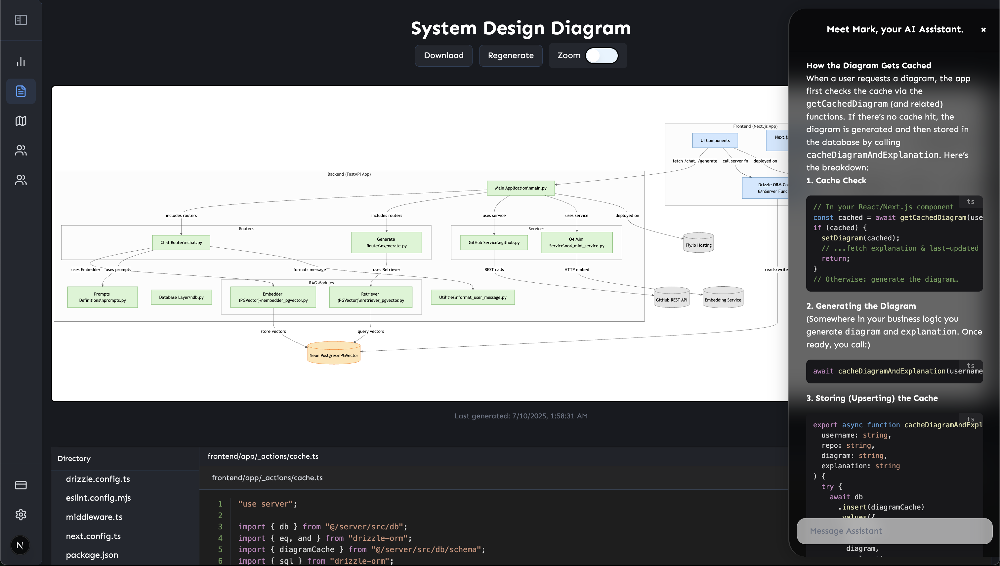
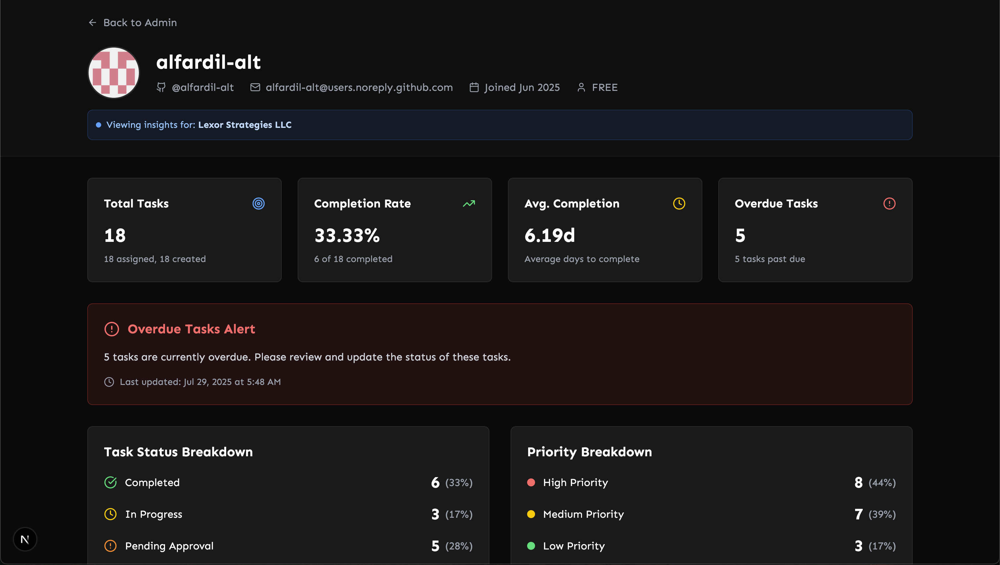

# Gitty

Welcome to Gitty - Your AI-Powered GitHub Repository Analysis & Team Collaboration Platform.

> **The tool for people who hate their employees** 🎭
>
> _"Why explain your codebase to new hires when AI can do it for you? Gitty: Making onboarding so easy, you'll forget what human interaction feels like!"_

## 🌐 Production URLs

- Frontend: [https://gitty.alfardil.com/](https://gitty.alfardil.com/)
- API Documentation: [https://devboard-api.fly.dev/docs](https://devboard-api.fly.dev/docs)
- API Base URL: [https://devboard-api.fly.dev](https://devboard-api.fly.dev)

**Deployment Details:**

- **Production Database:** Hosted on [Neon](https://neon.tech/)
- **Frontend:** Built with Next.js
- **Backend:** Deployed on [Fly.io](https://fly.io/)

## 🚀 Features

- **AI-Powered System Design Generation**

  - Automatically analyze any GitHub repository and generate interactive system design diagrams
  - Multi-phase AI processing: repository explanation → component mapping → Mermaid.js diagram generation
  - Interactive diagrams with clickable components that link directly to GitHub files
  - Customizable diagram generation with user instructions and reasoning effort controls

- **Intelligent Codebase Chat Assistant**

  - RAG (Retrieval-Augmented Generation) powered chat for repository-specific questions
  - Context-aware responses using vector similarity search and direct text matching
  - File-specific analysis with prioritized context from selected files
  - Streaming responses with real-time progress updates

     
  
     

- **GitHub Integration & Repository Management**

  - Seamless GitHub OAuth authentication
  - Browse and analyze personal repositories and organization repos
  - Repository insights with commit activity tracking and statistics
  - Support for both public and private repositories

- **Team Collaboration & Project Management**

  - Enterprise-based task management with Kanban-style roadmaps
  - Task creation, assignment, and status tracking with drag-and-drop functionality
  - Priority levels, due dates, tags, and assignment history
  - Team insights and user profile analytics
     
    
     

- **Developer Dashboard & Analytics**

  - Comprehensive insights view with repository and organization statistics
  - Recent commits tracking and activity visualization
  - User performance metrics and task completion analytics
  - Enterprise administration tools for team management

- **Advanced AI Capabilities**

  - OpenAI o4-mini integration for intelligent code analysis
  - Vector embeddings with pgvector for semantic search
  - Streaming responses for real-time user experience
  - Intelligent caching to reduce API costs and improve performance

## 📝 License

This project is licensed under the MIT License - see the LICENSE file for details.

## 👥 Contributing

Contributions are welcome! Please feel free to submit a Pull Request.
